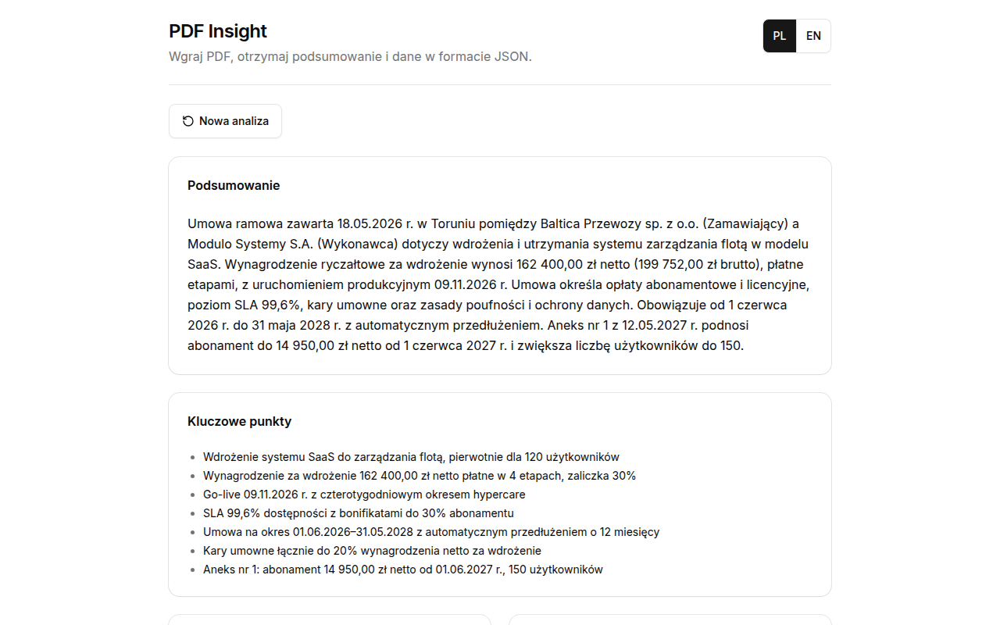

# PDF Insight

PDF Insight is a small web application that turns a PDF into a short, readable summary and a
validated structured JSON result. A React single-page app on GitHub Pages extracts the text in the
browser and sends it to a serverless function (a Supabase Edge Function) that asks Claude for the
analysis; the same Zod schema validates the result on the server and again in the browser before
anything is shown. [AI_LOG.md](AI_LOG.md) records how AI tools took part in building it.

## Live app

**[https://kiwagu.github.io/pdf-insight/](https://kiwagu.github.io/pdf-insight/)**



The interface is in Polish by default, with an English toggle in the header. To try the app without
a document of your own, use [docs/sample-contract.pdf](docs/sample-contract.pdf): a six-page Polish
framework agreement with fictional parties, fees in three currencies, a schedule of milestones and
service levels, and an annex on the last page that is a scanned image without a text layer.

## What it does

1. **Upload.** Drag a PDF onto the drop zone or pick one with the keyboard or the mouse. Only PDF
   files up to 10 MB are accepted; the first bytes must be the PDF signature (`%PDF-`).
2. **Read.** pdf.js reads the text of every page in the browser. A page without a usable text
   layer (fewer than 20 non-whitespace characters) is rendered to a JPEG image instead, at most
   five per document.
3. **Analyze.** The page texts and images go to the `analyze` function, which asks Claude for a
   summary of 3 to 5 sentences in the document's language and the structured data, validates the
   answer and retries once if it is invalid.
4. **Result.** The app shows the summary, key points, document fields, entities, amounts, dates,
   keywords and the analysis details, with a JSON preview that can be copied or downloaded as
   `<file name>.insight.json`. The last ten results are kept in this browser.

Every step has its state: progress while reading and analysing, an error with a retry button when
retrying can help, and an empty history before the first analysis.

## Architecture

```text
 Browser: React SPA on GitHub Pages        Supabase Edge Function "analyze"         Anthropic
+-----------------------------------+     +----------------------------------+     +-------------+
| 1. file check: PDF, 10 MB         |     | CORS allow-list                  |     |             |
| 2. pdf.js: text per page,         |     | body cap                         |     | Claude      |
|    scanned pages -> JPEG          | --> | Zod: request schema              | --> | Messages    |
|    request size check             |     | rate limit (Postgres RPC)        |     | API,        |
| 4. Zod: response and result       | <-- | chunk -> model calls -> reduce   | <-- | structured  |
|    render, copy, download         |     | Zod: strict answer, 1 retry      |     | output      |
|    history in localStorage        |     | merge, amount grounding, meta    |     |             |
+-----------------------------------+     +----------------------------------+     +-------------+
                                                         |
                                           Postgres: rate_limits + consume_rate_limit()
```

The repository is a Bun workspace run by Turborepo, split along ports and adapters: the rules of
an analysis live in pure packages, and every side effect sits behind a port that the browser or
the function implements.

- [`packages/contracts`](packages/contracts): Zod schemas for the result JSON and the HTTP API,
  the ISO 639-1 and ISO 4217 code lists, and the prefixed ids (`ana_` for an analysis, `req_` for a
  request). The single source of truth that both sides import.
- [`packages/domain`](packages/domain): the pure core. The ports (`TextExtractor`,
  `DocumentAnalyzer`, `AnalysisHistory`, `ModelPort`) are declared as function-typed properties;
  next to them sit page chunking, merging, scan-aware amount grounding, the one-retry helper and
  the two use cases, `analyzeText` (server side) and `analyzeDocument` (browser side). No IO: the
  id factory and the clock are passed in.
- [`packages/i18n`](packages/i18n): Polish and English catalogs, a translator, and a parity gate
  that fails lint when the two catalogs differ.
- [`apps/api`](apps/api): the function's runtime-agnostic request handler (CORS allow-list, body
  cap enforced while reading, Zod validation, a Postgres-backed rate limit with a deadline that
  fails open) and the Anthropic adapter (structured output, explicit stop-reason handling, strict
  validation of the answer, one retry through the domain).
- [`supabase/functions/analyze`](supabase/functions/analyze): the Deno entry that reads the
  environment, wires the adapters into the handler and calls `Deno.serve`.
- [`apps/web`](apps/web): the browser app on Vite, React 19, Tailwind CSS v4 and shadcn/ui on Base
  UI. It implements the browser ports: the pdf.js legacy build, loaded on the first upload, with
  scanned pages rendered to JPEG; the HTTP client; and the history in `localStorage`.
- [`packages/eslint-config`](packages/eslint-config) and
  [`packages/typescript-config`](packages/typescript-config): shared lint rules and strict compiler
  settings.

Each package and app has its own README with its exports and details. [`infra/dev`](infra/dev)
holds the local Supabase stack, and [`supabase/migrations`](supabase/migrations) the rate-limit
table and function.

**Where validation happens.**

1. In the browser, before anything is sent: the file size and PDF signature, and the exact size
   of the JSON request against the function's body cap.
2. At the function's boundary: `analyzeRequestSchema` (one text entry per page, at most 50 000
   characters per page, at most five page images of up to 2 000 000 base64 characters, image pages
   inside the page range).
3. On the model's answer: the model is given a structured output format, and the parsed answer is
   then checked against the strict `llmAnalysisSchema` (an ISO 639-1 language, ISO 4217
   currencies, `YYYY-MM-DD` dates that exist in the calendar, at most seven key points). The
   output format is a looser twin of that schema because structured outputs accept only a subset
   of JSON Schema. The whole-document summary must also be non-blank and three to five sentences
   (`countSentences`, which knows abbreviations such as `e.g.`, `Inc.` or `sp. z o.o.` and the
   sentence marks of scripts without letter case), and every page an amount or a date cites must
   exist in the document. An invalid answer is retried once, then reported as `analysis_failed`.
   The assembled result is parsed with `analysisResultSchema` before it leaves the function.
4. Back in the browser: the response envelope is parsed with `analyzeResponseSchema` and the
   result with `analysisResultSchema` before it is rendered or saved; history entries are
   validated again when they are read back from `localStorage`.

**Why the function is runtime-agnostic.** The handler is a plain web-standard
`(Request) => Promise<Response>` function that receives its model, rate limiter, id factories and
clock as arguments. Deno appears only in the short entry file, so the handler and its adapters are
tested in Node with Vitest, without the Supabase runtime, and moving to another platform
(Cloudflare Workers, Bun, Node) means a new entry file and, away from Supabase, another
`RateLimiter` adapter. Relative imports carry an explicit `.ts` extension so that Deno runs the
same source, and `deno.json` maps the workspace packages by path and the npm dependencies to
pinned versions.

**Long documents.** The page texts are grouped into chunks of at most 60 000 characters, split
only between pages and labelled `[page N]`. A document that fits in one chunk takes one model
call. A longer one is analysed chunk by chunk, at most three calls at a time, and a reduce call
consolidates the partial answers; the list fields are then merged and deduplicated.

## Result schema

Every analysis returns this JSON. The result keeps a fixed base shape; `page` on amounts and dates
and the `meta` block are additions to it. Keys are English, values are in the language of the
document (here a Polish contract), missing information is `null` or `[]`, dates are `YYYY-MM-DD`
and currencies ISO 4217 codes.

```json
{
  "document": {
    "fileName": "umowa.pdf",
    "pages": 4,
    "language": "pl",
    "type": "umowa",
    "title": "Umowa serwisowa",
    "date": "2026-09-01"
  },
  "summary": "Umowa określa zasady…",
  "keyPoints": ["Okres umowy 12 mies."],
  "entities": {
    "organizations": ["Przykład sp. z o.o."],
    "people": []
  },
  "amounts": [{ "value": 12500, "currency": "PLN", "context": "wynagrodzenie", "page": 2 }],
  "dates": [{ "date": "2026-10-01", "context": "termin płatności", "page": 3 }],
  "keywords": ["serwis", "SLA"],
  "meta": {
    "id": "ana_62hk1a18vffjxv2s.01m46f8btg",
    "model": "claude-opus-5-5",
    "chunks": 1,
    "scannedPages": [],
    "warnings": [],
    "durationMs": 14210,
    "analyzedAt": "2026-10-05T12:00:00.000Z"
  }
}
```

| Field                            | Meaning                                                                                                                                                                                                                  |
| -------------------------------- | ------------------------------------------------------------------------------------------------------------------------------------------------------------------------------------------------------------------------ |
| `document.language`              | ISO 639-1 code of the document's language.                                                                                                                                                                               |
| `document.type`                  | One of `faktura` (invoice), `umowa` (contract), `oferta` (offer), `raport` (report), `inne` (other).                                                                                                                     |
| `document.title`, `.date`        | The document's title and date, or `null`.                                                                                                                                                                                |
| `summary`, `keyPoints`           | 3 to 5 sentences (enforced on the whole-document answer, with one retry, and re-checked on every result in the browser); 3 to 7 short items (at most 7 is enforced).                                                     |
| `amounts[].value`                | A plain number (`184500`, not `"184 500,00 zł"`), with an ISO 4217 `currency`.                                                                                                                                           |
| `amounts[].page`, `dates[].page` | Added: the 1-based page the item was read from, or `null` when the model cannot tell.                                                                                                                                    |
| `meta`                           | Added: the analysis id, the model id, the number of chunks, the pages read as images, warnings (amounts dropped by grounding, pages without a text layer that were not read), the duration and the time of the analysis. |

The full JSON Schema (draft 2020-12, generated from the Zod schema by `analysisResultJsonSchema()`)
is [docs/analysis-result.schema.json](docs/analysis-result.schema.json). To regenerate it after a
schema change:

```bash
bun --cwd packages/contracts -e "import { analysisResultJsonSchema as s } from '@pdf-insight/contracts';
await Bun.write('../../docs/analysis-result.schema.json', JSON.stringify(s(), null, 2));"
bunx prettier --write docs/analysis-result.schema.json
```

## Security

- **The API key never reaches the browser.** `ANTHROPIC_API_KEY` exists only as a GitHub secret
  and as a secret of the Supabase function, which the deploy workflow sets. The browser bundle
  carries no key of any kind: the function is deployed with `verify_jwt = false`, so the app calls
  it without a Supabase key, and the function protects itself with the measures below. `.env`
  files are ignored by git (only `.env.example` and `infra/dev/functions.env.example`, with
  placeholders, are committed), and the hygiene gate in `bun run check` fails on a tracked env
  file, on secret-looking tokens and on absolute home paths, printing only `file:line` so that a
  real key never reaches a CI log.
- **CORS allow-list.** The `Origin` header must equal one of the `ALLOWED_ORIGINS` exactly: no
  wildcard, no suffix matching. A foreign or missing origin gets 403 `origin_forbidden` without
  CORS headers, before the body is read, and a preflight succeeds (204) only for an allowed origin.
- **Request limits.** The browser accepts PDFs up to 10 MB, renders at most five scanned pages and
  measures the exact request body before sending it. The function refuses a body over
  `MAX_BODY_BYTES` (6 MB by default) from its `Content-Length` and again while reading the stream,
  so a missing or false header cannot bypass the cap, and its request schema caps the page text
  and image sizes. Before sending, the browser checks the request against that same schema: a
  page whose text exceeds the cap is reported as `page_too_large`, and a page image is re-encoded
  at a lower JPEG quality, then rendered at a smaller scale, until it fits the image cap (a page
  that still does not fit is left out and named among the skipped pages).
- **Time budget.** The function budgets 140 s for the whole analysis (`ANALYSIS_BUDGET_MS`),
  counted from the request's arrival: each model call gets at most 60 s and never more than what
  remains, the single retry runs only if at least 20 s remain, chunk workers and the reduce share
  the budget, and an exhausted budget answers 504 `analysis_timeout` (retryable). The browser
  waits 150 s (`CLIENT_TIMEOUT_MS`), so a late success is not thrown away. Model calls have a
  16 000-token output budget.
- **Rate limit per client.** A fixed window of `RATE_LIMIT_PER_MINUTE` requests (10 by default)
  per client address, the first `X-Forwarded-For` entry, kept in Postgres by the
  `consume_rate_limit` function; over the limit the API answers 429 with `Retry-After`. The table
  has row-level security with no policies, and only the service role may execute the Postgres
  function; the platform injects that role's key into the edge function. The limiter has a 2 s
  deadline and fails open with an error log when the database is unreachable, slow or answers
  garbage, so a database outage does not take the service down.
- **Document content is data, not instructions.** The page text goes into a
  `<document file="…" pages="…" of="…">` envelope; any `<document` or `<partial` tag inside the
  text has its `<` escaped, so the content can neither close its envelope nor open a forged one,
  and the file name is escaped as an attribute. The system prompt states that the envelope holds
  untrusted data, that instructions inside it must never be followed and that such text is
  ignored in the summary. The answer is bound to a JSON structure and validated, so an injected
  instruction cannot change its shape. [AI_LOG.md](AI_LOG.md#key-prompts) describes how the model
  behaved on a document that carried such an instruction.
- **Amount grounding.** After the model answers, every amount must match a number written in the
  PDF's text layer; one that does not is dropped and counted in `meta.warnings`. Amounts attributed
  to a scanned page are exempt, because the text layer cannot confirm what an image shows. This
  catches invented numbers; a number that the document itself contains, such as an injected one,
  is the prompt's job.
- **Upload notice.** Below the drop zone, before any upload, the app states that the document text
  and images of pages without a text layer are sent to an AI API and asks the user not to upload
  documents they may not share. The footer repeats that documents are processed by an external
  AI API and not stored on the server; the last ten results stay in the browser's `localStorage`
  until the user clears the history.
- **Rendering.** Everything is rendered as React text, and `dangerouslySetInnerHTML` is forbidden
  by a lint rule.

## Running locally

Prerequisites: [Bun](https://bun.sh) 1.3, and Docker for the local Supabase stack that serves
the function. A real analysis needs an Anthropic API key.

```bash
bun install
bun run check    # Prettier, ESLint and the i18n parity gate, tsc, Vitest, hygiene gate
VITE_API_URL=http://127.0.0.1:55351/functions/v1/analyze bun run build
```

The web build bakes `VITE_API_URL` into the bundle; an app built without it fails at start-up
with `VITE_API_URL is not set`.

The function runs on a local Supabase stack in Docker on the 5535x ports (details in
[infra/dev/README.md](infra/dev/README.md)); starting the stack applies the migration:

```bash
bash infra/dev/stack.sh up         # start the stack; the first run pulls the images
cp infra/dev/functions.env.example infra/dev/functions.env   # then put a real key in it
bun run --cwd apps/api serve       # http://127.0.0.1:55351/functions/v1/analyze
curl -s -H 'origin: http://localhost:5173' http://127.0.0.1:55351/functions/v1/analyze/healthz
bash infra/dev/stack.sh status     # URLs and local keys
bash infra/dev/stack.sh down       # stop the stack
```

The web app, in a second terminal, at `http://localhost:5173/pdf-insight/`:

```bash
VITE_API_URL=http://127.0.0.1:55351/functions/v1/analyze bun run --cwd apps/web dev
```

Vite reads env files from `apps/web`, so the variables are passed on the command line or put in
`apps/web/.env.local` (ignored by git); [.env.example](.env.example) lists them. The local
gateway answers CORS preflights itself with a wildcard, but the function's own allow-list still
refuses an origin that `ALLOWED_ORIGINS` does not list.

| Where            | Variable                                                            | Default                    | Meaning                                                                                                                     |
| ---------------- | ------------------------------------------------------------------- | -------------------------- | --------------------------------------------------------------------------------------------------------------------------- |
| web build        | `VITE_API_URL`                                                      | (required)                 | URL of the analyze function, e.g. `https://<project-ref>.supabase.co/functions/v1/analyze`.                                 |
| web build        | `VITE_REPOSITORY_URL`                                               | unset                      | Repository link in the footer; the Pages workflow sets it from the GitHub context, and without it the footer shows no link. |
| function secret  | `ANTHROPIC_API_KEY`                                                 | (required)                 | Key for the Anthropic Messages API; never in the repository.                                                                |
| function secret  | `ALLOWED_ORIGINS`                                                   | `https://kiwagu.github.io` | Comma-separated exact origins allowed to call the function.                                                                 |
| function secret  | `LLM_MODEL`                                                         | `claude-opus-5-5`          | Model id.                                                                                                                   |
| function secret  | `LLM_EFFORT`                                                        | `low`                      | Effort level: `low`, `medium` or `high`.                                                                                    |
| function secret  | `MAX_BODY_BYTES`                                                    | `6000000`                  | Largest accepted request body, in bytes.                                                                                    |
| function secret  | `RATE_LIMIT_PER_MINUTE`                                             | `10`                       | Requests per client address per minute.                                                                                     |
| platform         | `SUPABASE_URL`, `SUPABASE_SERVICE_ROLE_KEY`                         | injected                   | Used only by the rate limiter.                                                                                              |
| GitHub secrets   | `SUPABASE_ACCESS_TOKEN`, `SUPABASE_PROJECT_ID`, `ANTHROPIC_API_KEY` |                            | Function deployment.                                                                                                        |
| GitHub variables | `VITE_API_URL`, `ALLOWED_ORIGINS`                                   |                            | Pages build, function CORS and the keep-alive check.                                                                        |

## Deployment

Four GitHub Actions workflows check, deploy and keep the function awake; both deploys run on a
push to `main` and can also be started by hand.

- [`ci.yml`](.github/workflows/ci.yml) runs on every push and pull request:
  `bun install --frozen-lockfile`, `bun run check` and `bun run build`.
- [`deploy-web.yml`](.github/workflows/deploy-web.yml) runs the same checks, builds `apps/web`
  with the `VITE_API_URL` variable and `VITE_REPOSITORY_URL` derived from the repository the
  workflow runs in, and publishes `apps/web/dist` to GitHub Pages.
- [`deploy-api.yml`](.github/workflows/deploy-api.yml) runs on changes to `apps/api`, `packages`,
  `supabase` or the workflow itself: the checks, then `supabase secrets set` for
  `ANTHROPIC_API_KEY` and `ALLOWED_ORIGINS`, then `supabase functions deploy analyze`.
- [`keepalive.yml`](.github/workflows/keepalive.yml) calls `/healthz` every six hours (cron
  `17 */6 * * *`), with the first allowed origin as `Origin`. A free Supabase project pauses after
  a week without requests; the health check also runs the rate-limit function, so the database
  sees activity too.

Repository settings the workflows need:

- Secrets: `SUPABASE_ACCESS_TOKEN`, `SUPABASE_PROJECT_ID`, `ANTHROPIC_API_KEY`.
- Variables: `VITE_API_URL` (the function URL) and `ALLOWED_ORIGINS` (the Pages origin without a
  path, `https://kiwagu.github.io` for the published app).
- Settings, Pages: source "GitHub Actions".

One manual step per Supabase project: apply the migration in
[`supabase/migrations`](supabase/migrations) (it asks for the database password):

```bash
bunx supabase login
bunx supabase link --project-ref <project-ref>
bunx supabase db push
```

`LLM_MODEL`, `LLM_EFFORT`, `MAX_BODY_BYTES` and `RATE_LIMIT_PER_MINUTE` keep their defaults unless
they are set with `bunx supabase secrets set NAME=value --project-ref <project-ref>`.

## Testing

`bun run check` runs Prettier, ESLint (with the i18n parity gate), `tsc` and Vitest in every
workspace, then the hygiene gate; CI runs it and the build on every push. The suites cover:

- **contracts**: the result schema accepts complete results and nulls or empty lists, and rejects
  impossible dates (`2026-02-30`), unknown currencies and languages, a lowercase currency, more
  than seven key points and missing keys; the request schema's page and image limits; the ids.
- **domain**: chunking by page, merging, the number reader and amount grounding (including table
  rows whose columns sit side by side, and amounts from scanned pages), the one-retry rule and both
  use cases with fake ports.
- **i18n**: the translator and the catalog parity check.
- **api**: the handler (CORS, health check, body cap with and without `Content-Length`, invalid
  JSON and schema, 429 with `Retry-After`, one retry then `analysis_failed`, upstream errors), the
  Anthropic adapter's stop-reason handling, the escaping of the prompt envelopes, the rate
  limiter's deadline and fail-open paths, and the environment parser.
- **web** (jsdom and Testing Library): the HTTP client and its timeout, the history store under
  storage failures, the file checks, the payload guard, the lazy pdf.js loader, the state reducer,
  superseded runs in the analysis hook, and the components (keyboard use of the drop zone, the
  result tables, JSON copy and download, history, language toggle).

There is no end-to-end suite in the repository. During development the function on the local
stack was exercised with Polish contracts that have a scanned page, among them one with a sentence
addressed to the AI hidden in its text: the answers came back in under 20 s with a four-sentence
summary and the amounts read from the scanned page, and the hidden sentence had no effect. The
production build was also driven in headless Chrome with the sample contract through the same
local function; the screenshot above comes from that run.

**Working on this repository.** [AGENTS.md](AGENTS.md) and [CLAUDE.md](CLAUDE.md) give coding
agents the same short guide: the layout, the gates, and the project rules in
[`.cursor/rules`](.cursor/rules) (ports-and-adapters boundaries, schema-first contracts, explicit
`.ts` extensions, tests first, the commit and branch flow, secrets, literal i18n keys, reuse
first, Bun). Three skills describe the day-to-day workflows:
[`pdf-insight-dev`](.claude/skills/pdf-insight-dev/SKILL.md) (setup, gates, the local stack, the
function and the web app), [`pdf-insight-review`](.claude/skills/pdf-insight-review/SKILL.md)
(how a change is reviewed before it lands) and
[`pdf-insight-release`](.claude/skills/pdf-insight-release/SKILL.md) (landing a reviewed change
on `main` and publishing).

## Decisions

| Decision                                                 | Alternatives considered                         | Why                                                                                                                                                                                                                                                                                                         |
| -------------------------------------------------------- | ----------------------------------------------- | ----------------------------------------------------------------------------------------------------------------------------------------------------------------------------------------------------------------------------------------------------------------------------------------------------------- |
| Supabase Edge Functions for the API, on a free project   | Cloudflare Workers; Vercel or Netlify functions | A familiar platform with an existing account and CLI workflow. Its costs are known and handled: a free project pauses after 7 days without requests (the keep-alive workflow), there is no built-in rate limiter (a small Postgres function), and the runtime is Deno (the handler stays runtime-agnostic). |
| Claude through the Anthropic API                         | Free-tier model providers                       | Strong Polish-language quality, resistance to prompt injection, vision for scanned pages in the same call, and structured outputs. A run costs cents, and the rate limit bounds the total.                                                                                                                  |
| `claude-opus-5-5` with `effort: low` by default          | A faster model first                            | Quality first. If responses get too slow for interactive use, `LLM_MODEL=claude-sonnet-5-5` is a configuration change, not a code change.                                                                                                                                                                   |
| Text extraction in the browser with pdf.js               | Uploading the PDF to the function               | The function stays small and the request carries only text plus at most five page images.                                                                                                                                                                                                                   |
| OCR through the model's vision on rendered page images   | Tesseract.js in the browser                     | No large WebAssembly download and no Polish language data; the images travel in the same request. Capped at five pages.                                                                                                                                                                                     |
| Chunking by page with map-reduce in the function         | Chunking in the browser                         | The function owns the model calls; the browser only shows progress.                                                                                                                                                                                                                                         |
| Amount grounding after the model answers                 | Trusting the prompt alone                       | A cheap, deterministic check against invented numbers, exempting scanned pages.                                                                                                                                                                                                                             |
| Bun, Turborepo and ports-and-adapters packages           | A single Vite project                           | The contracts are shared by both sides without duplication, and the boundaries are visible in the package graph.                                                                                                                                                                                            |
| TypeScript 6.0                                           | TypeScript 7                                    | `typescript-eslint` 8.71 supports TypeScript below 6.1, and the project relies on ESLint.                                                                                                                                                                                                                   |
| Zod 4                                                    | Zod 3                                           | `z.toJSONSchema` is built in, and the Anthropic SDK's `zodOutputFormat` accepts Zod 4 schemas.                                                                                                                                                                                                              |
| Prefixed ids from `entity-id` (`ana_…`, `req_…`)         | `crypto.randomUUID()`                           | An id says what it identifies and carries its creation time; the domain receives the factory as a function and never imports the library.                                                                                                                                                                   |
| Tailwind CSS v4 and shadcn/ui on Base UI                 | CSS Modules; shadcn/ui on Radix                 | Keyboard handling, focus management and ARIA come with the primitives, and the generated components are source files in the repository.                                                                                                                                                                     |
| `pl` as the default locale with an `en` catalog          | Hard-coded Polish                               | Polish-speaking users are the primary audience; a catalog costs little and the parity gate keeps both languages complete. No other locales.                                                                                                                                                                 |
| The conventions for coding agents live in the repository | Keeping that tooling outside the repository     | The code was written with AI coding agents, so the rules and workflows they follow are part of how it is built; a reader sees the conventions, and any agent working on it later follows the same ones.                                                                                                     |
| One branch per slice, each squash-landed on `main`       | One branch for everything                       | Several logical Conventional Commits on `main`, each a reviewed, self-contained slice.                                                                                                                                                                                                                      |

## Known limitations

- No authentication. Abuse is bounded only by the origin allow-list (which browsers enforce, other
  clients do not), the body cap and the per-address rate limit, and the rate limit is off while
  its database is unavailable.
- At most five pages without a text layer are read per document, as images. A document with some
  text is analysed in part: further pages without text are not read, `meta.scannedPages` lists
  the pages that were, and `meta.warnings` names the pages that were skipped. A fully scanned
  document with more pages without a text layer than that cap is refused with an explicit error
  (`ocr_limit`) instead of being analysed from five pages.
- The browser checks the API's per-page limits (the text length of a page, the size of a page
  image) before sending, and reports a specific error when a page exceeds them.
- An analysis has a fixed time budget: the browser waits up to 150 s for the answer, and the
  function budgets 140 s for the whole analysis, including the retry.
- Long documents are analysed in chunks: a reduce call writes the summary and the document fields,
  and the lists are merged and deduplicated mechanically. Contradictions between chunks are not
  reconciled beyond the reduce step.
- The model may still omit facts. Grounding checks amounts only, not dates, and `meta.warnings`
  reports the amounts it dropped, not what the model left out.
- Availability of the hosted app depends on the Anthropic account balance and the Supabase free
  plan. A free project pauses after 7 days without requests, which the keep-alive workflow
  prevents as long as GitHub Actions runs it.
- The history lives in one browser's `localStorage` (the last ten results) and is not synced.

## License

[MIT](LICENSE)
